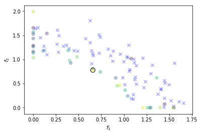

Alternative Infill Strategies for Expensive Multi-Objective Optimisation
========================================================================

| `A.
  Rahat <http://emps.exeter.ac.uk/computer-science/staff/aamr201>`__,
  `R.
  Everson <http://emps.exeter.ac.uk/computer-science/staff/reverson>`__,
  and `J.
  Fieldsend <http://emps.exeter.ac.uk/computer-science/staff/jefields>`__.
| `Department of Computer Science, University of Exeter,
  UK <http://emps.exeter.ac.uk/computer-science/>`__.

    This repository contains Python code for the infill streategies
    presented in **Alternative Infill Strategies for Expensive
    Multi-Objective Optimisation** by A. Rahat, R. Everson and J.
    Fieldsend, to appear in GECCO 2017 proceedings. Please refer to the
    *LICENSE* before using the code.

    Preprint repository:
    https://ore.exeter.ac.uk/repository/handle/10871/27157

    IPython notebook:
    http://nbviewer.jupyter.org/urls/bitbucket.org/arahat/gecco-2017/raw/6fb07690329d76e114af61c609bc6e720340570b/ReadME.ipynb

Pre-requisits.
--------------

The code here is a **Python3** implementation of the infill strategies.
The following modules are necessary to run the code here.

-  `DEAP <https://github.com/DEAP/deap>`__
-  `Numpy <http://www.numpy.org/>`__
-  `SciPy <https://www.scipy.org/>`__
-  `matplotlib <https://matplotlib.org/2.0.0/index.html>`__
-  `PyDOE <https://pythonhosted.org/pyDOE/>`__
-  `evoalgos <https://ls11-www.cs.tu-dortmund.de/people/swessing/evoalgos/doc/>`__
-  `GPy <https://github.com/SheffieldML/GPy>`__
-  `CMA <https://www.lri.fr/~hansen/html-pythoncma/frames.html>`__

To install any of these modules, just issue the following command in
your terminal.

``$ pip install module_name``

To install a module from github, use appropriate command. For instance:

``$ pip install git+https://github.com/DEAP/deap``

In addition to these, we used a custom module written in *C* for
dominance comparison. The code is given in the repository. To install
the module, use the following command wihtin the *FrontCalc* directory.

``$ python setup.py install``

    **Note.** As Python installations differ quite significantly, there
    may be other dependencies, but these should be standard modules from
    PyPi. If running the code results in complaints that something could
    not be imported, then please install the relevant module using
    *pip*.

Setting up.
-----------

The multi-objective evolutionary optimiser method
(*IscaOpt.Optimiser.EMO*) requires a *settings* dictionary along with
the multi-objective function and associated arguments or keyword
arguments. We list the the most pertinent settings below.

-  n\_dim (int): the number of dimensions in the parameter space.
-  n\_obj (int): the number of objectives, i.e. objective space
   dimensions.
-  lb (list or numpy array): an array of lower bounds in parameter space
   (1 in each dimension).
-  ub (list or numpy array): an array of upper bounds in parameter space
   (1 in each dimension).
-  ref\_vector (list or numpy array): reference vector in the objective
   space.
-  method\_name (str): the method to use for performing multi-objective
   optimisation (deafulats to 'HypI'). Options are:

   -  'HypI'
   -  'MSD'
   -  'DomRank'
   -  'MPoI'
   -  'SMSEGO'
   -  'ParEGO'

-  budget (int): the budget on the number of function evaluations.
-  n\_samples (int): the number of initial samples.
-  kern\_name (str): the kernel function to be used with Gaussian
   Processes. Defaults to **'Matern52'**. Please refer to GPy
   documentation for other options.
-  s\_vector (int): the number of scalarisation vectors for ParEGO.
-  maxfevals (int): the maximum number of function evaluations for
   infill criterion optimisation using CMA-ES. Defaults to
   :math:`20000d`, where :math:`d` is the number of dimensions in
   parameter space.
-  multisurrogate (bool): whether to use a multi-surrogate approach or
   not. Defaults to **False**, i.e. use a mono-surrogate approach.
-  cma\_options (dict): dictionary of settings for Hansen's CMA-ES code.
   See `CMA-ES
   documentation <https://www.lri.fr/~hansen/html-pythoncma/frames.html>`__
   for more details on avaialble options.
-  cma\_sigma (float): the extent of the standard deviation for CMA-ES.
   See `CMA-ES
   documentation <https://www.lri.fr/~hansen/html-pythoncma/frames.html>`__
   for details.
-  init\_file (str): intial design file. It should be a **.npz** file
   with 'arr\_0' set to decision variables matrix
   :math:`X \in \mathbb{R}^{M \times n}` and 'arr\_1' for corresponding
   function response vector
   :math:`\mathbf{f} \in \mathbb{R}^{M \times D}` (please refer to the
   paper for details on notations).
-  visualise (bool): it allows basic visualisations. Only available for
   the following cases: **n\_obj=2**; **n\_obj=1 and n\_dim=2**;
   **n\_obj=1 and n\_dim=1**.

    **Notes**\  \* This package can be used for single objective
    Bayesian optimisation. To do so, specify the method by setting
    **method\_name** to **'EGO'**, and of course **n\_obj** to **1**
    with an appropriate function. \* For one-dimensional search space
    and a single objective problem, we just use a grid-search instead of
    CMA-ES.

Running the optimiser.
----------------------

To run the optimiser it is sufficient to define an objective function
that may produce a response given a decision vector, and use appropriate
settings to call the multi-objective evolutionary optimiser method
(*IscaOpt.Optimiser.EMO*). Here we give an example of using the
optimiser.

An example.
~~~~~~~~~~~

*Problem description*: Use the optimiser to solve :math:`2`-objective
**DTLZ2** problem, starting with :math:`65` initial LHS samples and a
budget of :math:`100`.

.. code:: ipython3

    from IPython.display import clear_output
    # example set up
    import numpy as np
    # import optimiser codes
    import IscaOpt
    
    settings = {\
        'n_dim': 6,\
        'n_obj': 2,\
        'lb': np.zeros(6),\
        'ub': np.ones(6),\
        'ref_vector': [2.5]*2,\
        'method_name': 'HypI',\
        'budget':100,\
        'n_samples':65,\
        'visualise':True}
    
    # function settings
    from deap import benchmarks as BM
    fun = BM.dtlz2
    args = (2,) # number of objectives as argument
    
    # optimise
    res = IscaOpt.Optimiser.EMO(fun, args, settings=settings)
    clear_output()

In the Figure above, the blue crosses show the initial samples, and the
solid circle show the newly sampled solutions with darker colours
showing earlier samples. The black encircled solid is the latest sample.

Errata
------

-  Equation (5) should be as follows.
   :math:`\alpha(\mathbf{x}, f^*) = \int_{-\infty}^{\infty}I(\mathbf{x}, f^*)P(\hat{f}|\mathbf{x},\mathcal{D})d\hat{f} = \sigma(\mathbf{x})(s\Phi(s) + \phi(s))`.

Contact
-------

For any comments, queries or suggestions, please send an email to:
**a.a.m.rahat@exeter.ac.uk**